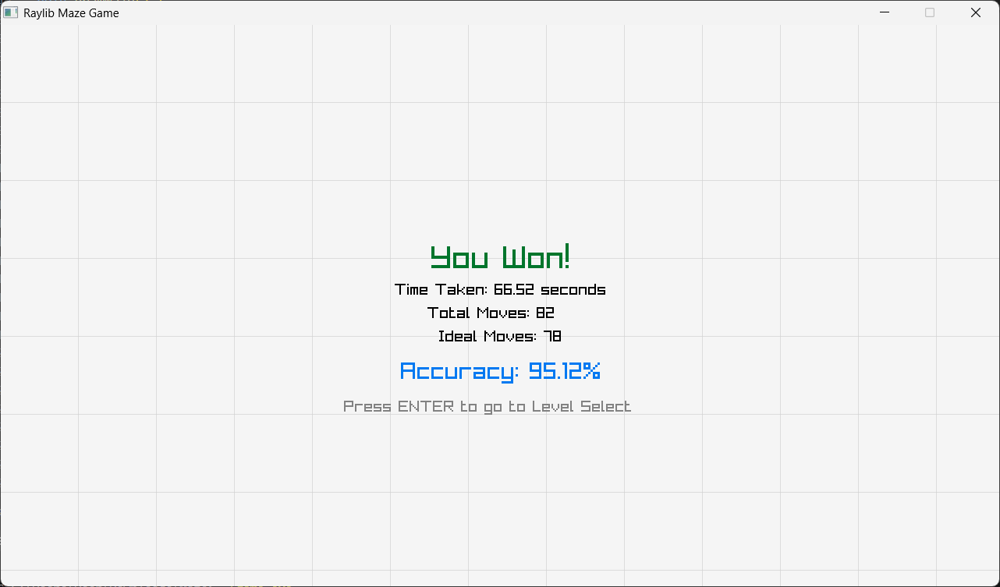

# 👾 The Labyrinth Explorer: A Procedural Maze Generator Game

This project is a 2D Maze Game designed to showcase and compare various graph-based maze generation algorithms. Each difficulty level loads a unique maze structure, offering a distinct challenge based on the underlying logic.

---

## ✨ Key Features

- 🔄 Dynamic Maze Generation: Generates a new maze every time a level starts.
- 🎚️ Four Difficulty Levels: Easy, Medium, Hard, Expert — with increasing grid sizes.
- 🔀 Custom Difficulty Curve: Easy and Medium algorithms are intentionally swapped for a unique progression.
- 🎯 Enhanced Exit Indicator: High-speed, color-shifting pulse effect for visibility during presentations.

---


## 🏷️Project Badges


## 🧠 Algorithm Mapping

| Level Index | Level Name | Algorithm Used         | Maze Characteristic                          | Rationale for Swap                          |
|-------------|------------|------------------------|-----------------------------------------------|---------------------------------------------|
| 0           | EASY       | `generateMazeBFS()`    | Short, wide passages                          | Feels more open for beginners               |
| 1           | MEDIUM     | `generateMazeDFS()`    | Long, winding path with dead ends             | Requires backtracking, feels more complex   |
| 2           | HARD       | `generateMazeKruskal()`| Uniform mesh with short dead ends             | Balanced challenge                          |
| 3           | EXPERT     | `generateMazePrim()`   | Dense maze with winding paths and dead ends   | Highest difficulty                          |

---

## 🕹️ Controls

| Action             | Key(s)             |
|--------------------|--------------------|
| Move Up            | `W` or `↑`         |
| Move Down          | `S` or `↓`         |
| Move Left          | `A` or `←`         |
| Move Right         | `D` or `→`         |
| Restart Level      | `R` (during game)  |
| Back to Menu       | `ESC` (from menus) |

---

## 📸 Assets and Media

Include visuals to enhance presentation and documentation.

- **Home Menu / Title Screen**  
  

- **Gameplay Screenshots**  
  
  
  

  

  

  

  

  


---

## ⚙️ Setup and Build

This is a C++ project built using the Raylib library.


### Prerequisites

- C++ Compiler (e.g., GCC, Clang)
- Raylib development libraries

### Build Instructions

bash
```
# Compile using GCC and Raylib
g++ main.cpp -o maze_game -lraylib -lGLESv2

# Run the game
./maze_game
```

## 📁 Project Structure
```
Maze-Game/
├── assets/
│   ├── main_menu.jpg
│   ├── medium_level.png
│   └── exit_pulse.gif
├── main.cpp
├── README.md
└── game.exe
```

## 📦 Dependencies

- [Raylib](https://www.raylib.com/) — graphics and input
- `mt19937` — random number generation
- STL containers: `stack`, `queue`, `vector`, `map`


## 🧪 Debugging Tools

- Press `L` to toggle grid lines
- Press `T` to show ideal path overlay
- Console logs for algorithm steps (optional)

## 📜 License

This project is licensed under the MIT License. See [LICENSE](https://github.com/Angkon-Kar/License) for details.


## 🚀 Future Improvements

- Add timer-based scoring
- Implement multiplayer maze race
- Export maze as image or JSON

## 🧩 Planned Features

- Export maze as `.png` or `.json`
- Add maze editor with drag-and-drop tiles
- Leaderboard integration for timed runs


## 📈 Performance

- Maze generation time (Expert level): ~120ms
- Frame rate: Stable 60 FPS on mid-range hardware

## 🤝 Contributing

Pull requests are welcome. For major changes, please open an issue first to discuss what you’d like to change.
Please make sure to update tests as appropriate.


